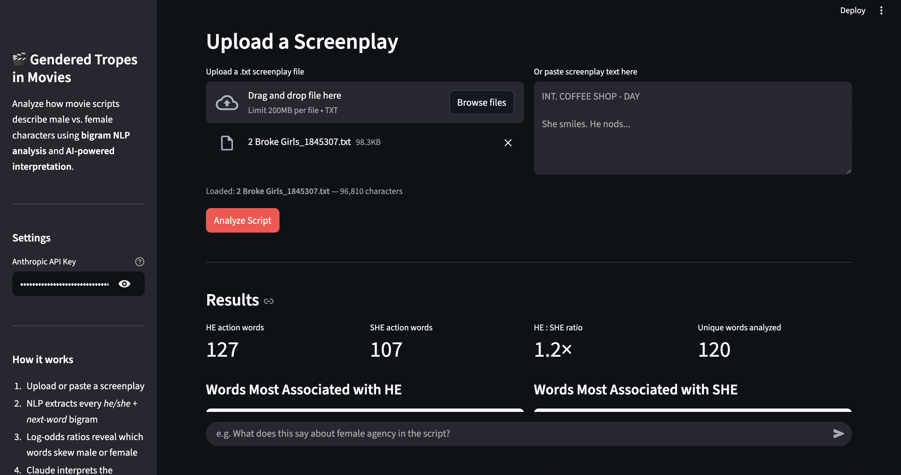

# Gendered Tropes in Movies

An AI-powered web app that analyzes movie screenplays for gender representation patterns using NLP and Claude AI.

Inspired by *[She Giggles, He Gallops](https://pudding.cool/2017/08/screen-direction/)* by The Pudding.

## What it does

Upload any movie screenplay and the app will:
- Extract every *he/she + action word* bigram from the script
- Use **log-odds ratios** to find which words are statistically more associated with male vs. female characters
- Display bar charts comparing gendered language
- Use **Claude AI** to generate a natural language interpretation of the findings
- Let you **chat** with the AI to ask follow-up questions about the gender tropes found

## Demo



## Tech Stack

- **Python** — NLP analysis (NLTK, pandas, numpy)
- **Streamlit** — web interface
- **Anthropic Claude API** — AI narrative and chat
- **Matplotlib** — visualizations

## Setup

**1. Clone the repo**
```bash
git clone https://github.com/purnimapal11/gendered-tropes-app.git
cd gendered-tropes-app
```

**2. Install dependencies**
```bash
pip install -r requirements.txt
```

**3. Add your Anthropic API key**

Either set it as an environment variable:
```bash
export ANTHROPIC_API_KEY=your_key_here
```

Or just paste it into the sidebar when the app opens.

**4. Run the app**
```bash
python3 -m streamlit run app.py
```

Then open `http://localhost:8501` in your browser.

## How the analysis works

1. The screenplay text is tokenized and lowercased
2. Every instance of `he <word>` and `she <word>` is counted (stopwords and short words filtered out)
3. Log-odds ratios are computed with Laplace smoothing to quantify how strongly each word skews male or female
4. The top 15 words for each gender are visualized and sent to Claude for interpretation

## Project Structure

```
├── app.py           # Streamlit web app
├── analysis.py      # NLP bigram + log-odds analysis
├── requirements.txt
└── README.md
```
